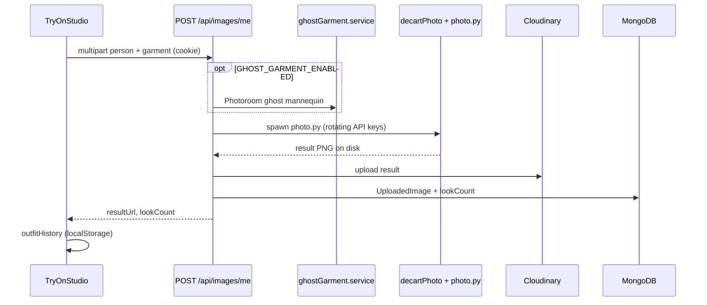
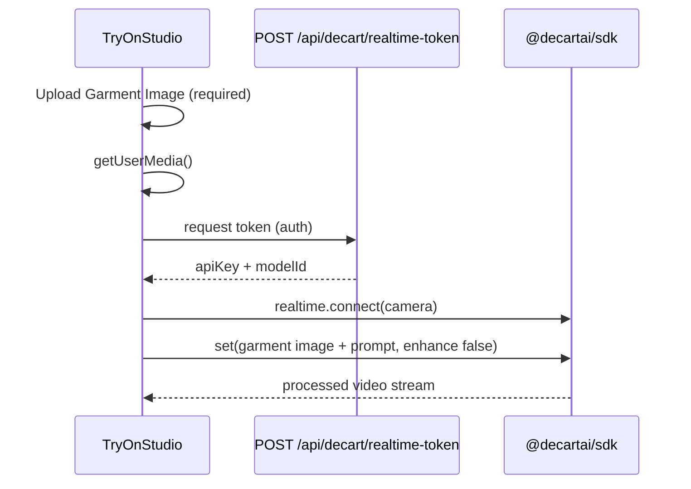

# Weartual — Project Reference

Virtual try-on web app: upload a person (photo or video) + garment image, get an AI-generated result. Includes live camera try-on via WebRTC.

**Setup and usage:** see **[README.md](./README.md)**.

**Monorepo root (git):** `frontend/mushi/`  
**Frontend:** `weartual/` (Vite + React 19 PWA)  
**Backend:** `server/` (Express + MongoDB + Python preprocessing)

---

## Quick start

| App | Directory | Command | Default URL |
|-----|-----------|---------|-------------|
| Backend | `server/` | `npm run dev` | `http://localhost:5001` (see `PORT` in `.env`) |
| Frontend | `weartual/` | `npm run dev` | `http://localhost:5173` |

1. Copy env files (see [Environment variables](#environment-variables)).
2. Copy `server/preprocessing/vendor_cache/llvmpass.registry.example` → `llvmpass.registry` and add Decart API tokens.
3. Run `npm install` in `server/` (runs `postinstall` → installs Python `decart` into `python_vendor/`).
4. Set `weartual/.env`: `VITE_API_URL=http://localhost:5001`.

---

## Repository layout

```
mushi/
├── PROJECT.md                 ← this file
├── .gitignore
├── server/
│   ├── src/
│   │   ├── server.js          # Entry: dotenv, DB, listen
│   │   ├── app.js             # Express + CORS + route mounts
│   │   ├── routes/            # auth, images, feedback, decart
│   │   ├── controllers/
│   │   ├── services/
│   │   ├── models/            # User, UploadedImage, Feedback
│   │   ├── middlewares/
│   │   ├── config/            # db, cloudinary, email
│   │   └── utils/
│   ├── preprocessing/
│   │   ├── photo.py           # Image try-on (Decart lucy-image-2)
│   │   ├── irl.py             # Video try-on (Decart realtime)
│   │   ├── ghost/ghost.py     # Garment prep (Photoroom)
│   │   └── vendor_cache/      # API keys, prompts, registry loader
│   ├── uploads/               # Runtime uploads (gitignored)
│   ├── result/                # Generated files on disk (gitignored)
│   ├── python_vendor/         # pip -t decart (postinstall, gitignored)
│   ├── requirements.txt
│   └── .env
└── weartual/
    ├── src/
    │   ├── App.jsx            # Routes
    │   ├── pages/             # UI screens
    │   ├── services/          # API clients
    │   └── config/api.js      # VITE_API_URL
    ├── public/dataset/        # Bundled sample images
    └── .env
```

**Note:** Large ML folders under `server/preprocessing/` (detectron2, GRAPHONOMY, etc.) are gitignored.

---

## Frontend pages & routes

Defined in `weartual/src/App.jsx`. Global `Navbar` + page transitions (`AnimatedRoutesLayout`).

| Path | Page | Auth |
|------|------|------|
| `/` | `LandingPage` | Public |
| `/studio` | `TryOnStudio` | Try-on requires login at runtime |
| `/history` | `OutfitHistory` | Works with/without user; syncs when logged in |
| `/profile` | `Profile` | Redirects to `/login` if guest |
| `/about` | `AboutUs` | Public |
| `/contact` | `Contact` | Public |
| `/login` | `login` | Redirects home if already logged in |
| `/signup` | `signup` | Redirects home if already logged in |
| `/forgot-password` | `forgetpassword` | Public |
| `/reset-password/:token` | `ResetPassword` | Public |
| `*` | → `/` | — |

**Bootstrap:** On load, `getMe()` restores session from JWT cookie. `tryMigrateAnonymousOutfitHistory()` merges local history when user logs in.

### Main frontend modules

| File | Role |
|------|------|
| `services/authApi.js` | Signup, login, Google auth, profile, logout |
| `services/imageApi.js` | Upload try-on, list/delete looks, dataset samples |
| `services/decartRealtime.js` | Live WebRTC try-on (`connectDecartVirtualTryOn`, `applyLiveRealtimeSet`) |
| `services/outfitHistory.js` | Local history + ratings (`localStorage`) |
| `services/feedbackApi.js` | Contact form submission |
| `config/api.js` | `API_URL` from `VITE_API_URL` |
| `pages/TryOnStudio.jsx` | Core try-on UI (image, video, live camera) |

All API calls use `credentials: "include"` for the auth cookie.

---

## Backend API

Mounted in `server/src/app.js`. Base path: `/api`.

### Health

| Method | Path | Description |
|--------|------|-------------|
| GET | `/api/health` | Server alive check |

### Auth — `/api/auth`

| Method | Path | Auth | Handler |
|--------|------|------|---------|
| POST | `/signup` | — | Create account |
| POST | `/login` | — | Email/password → JWT cookie |
| POST | `/google` | — | Google ID token login |
| POST | `/logout` | — | Clear cookie |
| POST | `/forgot-password` | — | Send reset email |
| POST | `/reset-password/:token` | — | Set new password |
| GET | `/me` | ✓ | Current user |
| PATCH | `/me` | ✓ | Update profile |
| POST | `/me/link-google` | ✓ | Link Google to web account |
| POST | `/me/avatar` | ✓ | Upload avatar (Cloudinary) |
| POST | `/me/notifications` | ✓ | Expo push settings |

### Images / try-on — `/api/images`

| Method | Path | Auth | Handler |
|--------|------|------|---------|
| GET | `/samples` | — | List UI sample images |
| GET | `/samples/file` | — | Serve sample file |
| GET | `/me` | ✓ | List saved looks |
| GET | `/me/look-count` | ✓ | User look count |
| POST | `/me` | ✓ | **Main try-on upload** (`image` + `garment` multipart) |
| POST | `/me/delete-by-result` | ✓ | Delete look by result URL |
| DELETE | `/me/:jobId` | ✓ | Delete look by id |
| GET | `/jobs/:jobId/decart-result` | ✓ | Stream local MP4 (video jobs) |

### Decart live — `/api/decart`

| Method | Path | Auth | Handler |
|--------|------|------|---------|
| POST | `/realtime-token` | ✓ | Short-lived WebRTC token + `modelId` |

### Feedback — `/api/feedback`

| Method | Path | Handler |
|--------|------|---------|
| POST | `/` | Save feedback + send acknowledgment email |

---

## Main backend services

### `images.service.js` — core try-on orchestration

| Export | Purpose |
|--------|---------|
| `uploadImageService` | Validates files, runs pipelines, uploads to Cloudinary, saves `UploadedImage` |
| `listMyImagesService` | Returns looks with `resultUrl` |
| `getAccountLookCountService` | Count + sync `User.totalLookCount` |
| `deleteMyImageService` | Delete a saved look |
| `listDatasetSamplesService` | Sample gallery for studio UI |

**Upload logic (simplified):**

1. Write person + garment buffers to `server/uploads/`.
2. Upload originals to Cloudinary (parallel with processing).
3. If person is **video** → `runDecartIrlPipeline` → `irl.py` → transcode → Cloudinary video.
4. If person is **image**:
   - If `GHOST_GARMENT_ENABLED` → `runGhostGarmentPipeline` → `ghost/ghost.py` (Photoroom).
   - `runDecartPhotoPipeline` → `photo.py`.
5. Upload result to Cloudinary; create/update MongoDB `UploadedImage`.

### Decart pipelines

| File | Export | Spawns |
|------|--------|--------|
| `decartPhoto.service.js` | `runDecartPhotoPipeline` | `preprocessing/photo.py` |
| `decartIrl.service.js` | `runDecartIrlPipeline` | `preprocessing/irl.py` |
| `ghostGarment.service.js` | `runGhostGarmentPipeline` | `preprocessing/ghost/ghost.py` |
| `decart.controller.js` | `createRealtimeToken` | `@decartai/sdk` (no Python) |

All Python runs use `mergeDecartVendorPythonPath()` so `decart` imports from `server/python_vendor/`. API keys are passed per run as `DECART_API_KEY` (from registry, not `.env`).

### Key rotation — `vendor_cache/registry.js`

- Reads tokens from `preprocessing/vendor_cache/llvmpass.registry` (gitignored).
- `getDecartApiKeysForTryOn()` shuffles keys and skips keys in cooldown (`decartKeyCooldown.js`).
- Used by photo, irl, and live token endpoints.

### Auth — `auth.service.js`

Signup/login, Google OAuth (`google-auth-library`), password reset emails, profile, avatar upload.

---

## Python preprocessing

### `photo.py` — static image try-on

- **CLI:** `python photo.py <person> <garment> <output.png>`
- **Model:** Decart `lucy-image-2`
- **Prompt:** `vendor_cache/prompts/image_tryon.txt` via `prompt_loader.load_prompt("image_tryon")`
- **Env (optional):** `IMAGE_TRYON_FAST`, `DECART_IMAGE_RESOLUTION`, `DECART_ENHANCE_PROMPT`, `DECART_PERSON_MAX_SIDE`, `DECART_GARMENT_MAX_SIDE`, `DECART_SIMILARITY_THRESHOLD`
- **Exit code 3:** No visible change (person unchanged) → server returns 422

### `irl.py` — video try-on

- **CLI:** `python irl.py <video> <garment_ref> <output.mp4>`
- **Model:** Decart realtime `lucy-2.1-vton`
- **Prompt:** `vendor_cache/prompts/video_tryon.txt`
- Feeds local video via `MediaPlayer`, collects remote WebRTC frames, writes MP4.

### `ghost/ghost.py` — garment prep (Photoroom)

- **CLI:** `python ghost.py <input> <output>`
- **API:** `https://image-api.photoroom.com/v2/edit` (ghost mannequin)
- **Env:** `PHOTOROOM_API_KEY` (in `server/.env` only)

### `vendor_cache/`

| File | Purpose |
|------|---------|
| `llvmpass.registry` | Decart API tokens (local only, gitignored) |
| `llvmpass.registry.example` | Template |
| `registry.js` | Node loader for tokens |
| `prompt_loader.py` | Python prompt loader |
| `prompts/image_tryon.txt` | Image try-on prompt |
| `prompts/video_tryon.txt` | Video/live-style prompt |

---

## Try-on flows (end-to-end)

### A. Image try-on (studio upload)



**Frontend entry:** `TryOnStudio` → `uploadMyImage()` in `imageApi.js`.

### B. Video try-on

Same `POST /api/images/me`; server detects video MIME/extension → `runDecartIrlPipeline` → ffmpeg transcode → Cloudinary `resource_type: video`.

Optional playback: `GET /api/images/jobs/:jobId/decart-result` streams local MP4 if still on disk.

### C. Live camera try-on (WebRTC)

In **Try On Studio**, choose **Live** as the person input mode. Live try-on uses Decart realtime (`lucy-vton-2` by default) over WebRTC.



**Frontend:** `connectDecartVirtualTryOn()` and `applyLiveRealtimeSet()` in `decartRealtime.js`.  
**Backend:** `createRealtimeToken` in `decart.controller.js`.

#### Live try-on rules (garment + optional accessories)

Decart realtime accepts **one reference image** per `set()` call. The studio always uses the **Garment Image** block as that reference.

| Setting | Reference image | Prompt |
|---------|-----------------|--------|
| **Add accessories** off | Garment Image | Fixed garment VTON prompt (`PROMPT_GARMENT_LIVE` in code) |
| **Add accessories** on | Same Garment Image | Garment prompt + your extra text (glasses, watch, hat, cap, etc.) in **one** combined string |

Important implementation details:

- **One atomic `set()`** — garment file + full prompt are sent together. Do **not** call `setPrompt()` afterward; a second prompt-only update drops the garment try-on after a few seconds.
- **`enhance` is always `false`** for live garment mode so Decart does not rewrite the VTON instructions.
- **`VITE_DECART_VTON_PROMPT`** — default **accessory** text when the extra prompt field is empty (not the main garment prompt).
- **Connect** requires a garment upload; accessories are optional text only (no second reference upload).
- While connected, use **Re-apply garment** or **Re-apply garment + accessory** after changing garment or accessory text.

Captured live frames can be saved as JPEG and run through the **offline image** pipeline (`POST /api/images/me`).

---

## Environment variables

Never commit `.env` or `llvmpass.registry`. Values below are **names only**.

### `server/.env`

| Variable | Purpose |
|----------|---------|
| `PORT` | HTTP port (default `5000` if unset) |
| `NODE_ENV` | `development` / `production` (cookies, errors) |
| `MONGODB_URI` | MongoDB connection string |
| `JWT_SECRET` | JWT signing secret |
| `JWT_EXPIRES_IN` | JWT lifetime (e.g. `7d`) |
| `GOOGLE_CLIENT_ID` | Google OAuth client ID(s), comma-separated |
| `CLIENT_URL` | Allowed CORS origins, comma-separated |
| `MOBILE_APP_ORIGINS` | Extra CORS for mobile WebView |
| `CLOUDINARY_CLOUD_NAME` | Cloudinary cloud |
| `CLOUDINARY_API_KEY` | Cloudinary API key |
| `CLOUDINARY_API_SECRET` | Cloudinary secret |
| `CLOUDINARY_TIMEOUT_MS` | Upload timeout (default 120000) |
| `PHOTOROOM_API_KEY` | Photoroom ghost mannequin |
| `SMTP_HOST`, `SMTP_PORT`, `SMTP_USER`, `SMTP_PASS` | Email (password reset, feedback) |
| `FROM_EMAIL`, `COMPANY_EMAIL` | Email from / inbox |
| `DECART_PHOTO_SCRIPT` | Override path to `photo.py` |
| `DECART_IRL_SCRIPT` | Override path to `irl.py` |
| `GHOST_SCRIPT` | Override path to `ghost.py` |
| `DECART_PYTHON` | Python executable (`python` / `python3`) |
| `GHOST_GARMENT_ENABLED` | `true` / `false` — skip Photoroom when false |
| `TRYON_VENDOR_REGISTRY` | Override path to `llvmpass.registry` |
| `DECART_REALTIME_MODEL` | Live model (default `lucy-vton-2`) |
| `DECART_REALTIME_TOKEN_TTL_SEC` | Live token TTL (60–3600) |
| `DECART_REALTIME_ALLOWED_ORIGINS` | Extra WebRTC allowed origins |
| `DECART_KEY_COOLDOWN_MS` | API key cooldown after quota errors |
| `IMAGE_TRYON_FAST` | Faster image try-on in Python |
| `STABLE_VITON_DATASET_DIR` | Optional local dataset root for samples |
| `FFMPEG_PATH` | Override ffmpeg binary |
| `EXPO_ACCESS_TOKEN` | Expo push notifications (optional) |

**Not in `.env`:** Decart API keys live in `llvmpass.registry`. `DECART_API_KEY` is set per Python subprocess at runtime.

### `weartual/.env`

| Variable | Purpose |
|----------|---------|
| `VITE_API_URL` | Backend base URL (**required**) |
| `VITE_GOOGLE_CLIENT_ID` | Google Sign-In button |

### Optional frontend (`decartRealtime.js`)

| Variable | Purpose |
|----------|---------|
| `VITE_DECART_REALTIME_MODEL` | Live model override |
| `VITE_DECART_LIVE_MIRROR` | Camera mirror: `true` / `false` / auto |
| `VITE_DECART_VTON_PROMPT` | Default **accessory** prompt when “Add accessories” is on and the textarea is empty |
| `VITE_DECART_LIVE_MAX_KEY_ATTEMPTS` | Connect retries |
| `VITE_DECART_LIVE_MAX_MID_ROTATIONS` | Mid-session key rotation |
| `VITE_DECART_API_KEY` | Dev-only fallback if token endpoint fails |

---

## Database models (MongoDB / Mongoose)

### `User`

`username`, `email`, `loginPlatform` (`web` | `google`), `googleSub`, `linkedGoogleEmail`, `password` (hashed), `resetPasswordToken`, `resetPasswordExpires`, `totalLookCount`, `avatarUrl`, `avatarPreset`, `expoPushToken`, `notificationsEnabled`, timestamps.

### `UploadedImage` (saved “look”)

`userId`, `imageFilename`, `garmentFilename`, `imageUrl`, `garmentUrl`, `resultUrl`, `resultFilename`, `resultType` (`image` | `video`), `stableVitonBundle`, timestamps.

A row counts as a saved look when `resultUrl` is set.

### `Feedback`

`name`, `email`, `feedback` (message), timestamps.

---

## External services

| Service | Used for |
|---------|----------|
| **Decart** | Image try-on, video try-on, live WebRTC |
| **Cloudinary** | Person/garment/result media, avatars |
| **Photoroom** | Ghost mannequin garment prep |
| **MongoDB Atlas** | Users, looks, feedback |
| **Google OAuth** | Sign-in |
| **Gmail SMTP** | Password reset, feedback emails |
| **Expo Push** | Mobile notifications (optional) |
| **ffmpeg-static** | H.264 transcode for browser video playback |

---

## NPM scripts

### Server (`server/package.json`)

| Script | Command |
|--------|---------|
| `dev` | `nodemon src/server.js` |
| `start` | `node src/server.js` |
| `postinstall` | Install Python deps into `python_vendor/` |
| `migrate:strip-job-fields` | Legacy DB cleanup script |

### Frontend (`weartual/package.json`)

| Script | Command |
|--------|---------|
| `dev` | `vite` |
| `build` | `vite build` |
| `preview` | `vite preview` |
| `lint` | `eslint .` |

---

## Auth flow

1. Login/signup/Google → server issues JWT.
2. Token stored in **HTTP-only cookie** (`token`); also returned in JSON for some clients.
3. `requireAuth` middleware verifies JWT on protected routes.
4. Production cookies: `secure`, `sameSite: none` (cross-origin with Netlify + Render).

---

## File map (important paths)

| Concern | Path |
|---------|------|
| Express entry | `server/src/server.js` |
| Routes mount | `server/src/app.js` |
| Try-on upload | `server/src/controllers/images.controller.js` → `images.service.js` |
| Live token | `server/src/controllers/decart.controller.js` |
| Image pipeline | `server/src/services/decartPhoto.service.js` → `preprocessing/photo.py` |
| Video pipeline | `server/src/services/decartIrl.service.js` → `preprocessing/irl.py` |
| Ghost garment | `server/src/services/ghostGarment.service.js` → `preprocessing/ghost/ghost.py` |
| API keys | `server/preprocessing/vendor_cache/llvmpass.registry` |
| Prompts | `server/preprocessing/vendor_cache/prompts/*.txt` |
| Studio UI | `weartual/src/pages/TryOnStudio.jsx` |
| Live WebRTC client | `weartual/src/services/decartRealtime.js` |

---

## Deployment notes

- **Frontend:** Netlify (`https://weartual.netlify.app` in `CLIENT_URL`).
- **Backend:** Render or similar; set all `server/.env` vars; run `postinstall` for Python vendor.
- Ensure `CLIENT_URL` includes your frontend origin for CORS + cookies.
- Copy `llvmpass.registry` to the server filesystem (not in git).

---

*Last updated: includes live try-on garment-always + merged accessory prompt behavior. For secrets, use `.env` and `llvmpass.registry` only — never commit them.*
