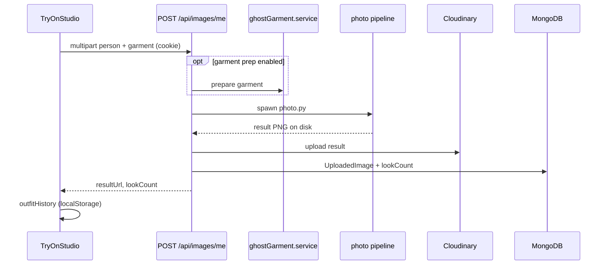
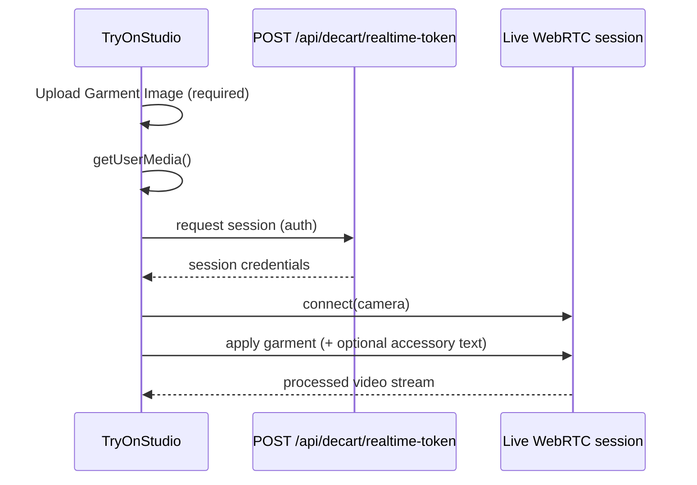

# Weartual — Project Reference

Virtual try-on web app: upload a person (photo or video) + garment image, get an AI-generated result. Includes live camera try-on via WebRTC.

**Setup and usage:** see **[README.md](./README.md)**.

**Monorepo root (git):** `frontend/mushi/`  
**Frontend:** `weartual/` (Vite + React 19 PWA)  
**Backend:** `server/` (Express + MongoDB + Python preprocessing)

---

## Quick start

| App | Directory | Command | Default URL |
|-----|-----------|---------|-------------|
| Backend | `server/` | `npm run dev` | `http://localhost:5001` (see `PORT` in `.env`) |
| Frontend | `weartual/` | `npm run dev` | `http://localhost:5173` |

1. Configure `server/.env` and `weartual/.env` with the values for your environment (never commit them).
2. Run `npm install` in `server/` (runs `postinstall` → Python deps into `python_vendor/`).
3. Set `weartual/.env`: `VITE_API_URL=http://localhost:5001`.

---

## Repository layout

```
mushi/
├── PROJECT.md                 ← this file
├── .gitignore
├── server/
│   ├── src/
│   │   ├── server.js          # Entry: dotenv, DB, listen
│   │   ├── app.js             # Express + CORS + route mounts
│   │   ├── routes/            # auth, images, feedback, live try-on
│   │   ├── controllers/
│   │   ├── services/
│   │   ├── models/            # User, UploadedImage, Feedback
│   │   ├── middlewares/
│   │   ├── config/            # db, cloudinary, email
│   │   └── utils/
│   ├── preprocessing/
│   │   ├── photo.py           # Image try-on pipeline
│   │   ├── irl.py             # Video try-on pipeline
│   │   ├── ghost/ghost.py     # Optional garment prep
│   │   └── vendor_cache/      # Local pipeline support files
│   ├── uploads/               # Runtime uploads (gitignored)
│   ├── result/                # Generated files on disk (gitignored)
│   ├── python_vendor/         # pip packages (postinstall, gitignored)
│   ├── requirements.txt
│   └── .env
└── weartual/
    ├── src/
    │   ├── App.jsx            # Routes
    │   ├── pages/             # UI screens
    │   ├── services/          # API clients
    │   └── config/api.js      # VITE_API_URL
    ├── public/dataset/        # Bundled sample images
    └── .env
```

**Note:** Large ML folders under `server/preprocessing/` (detectron2, GRAPHONOMY, etc.) are gitignored.

---

## Frontend pages & routes

Defined in `weartual/src/App.jsx`. Global `Navbar` + page transitions (`AnimatedRoutesLayout`).

| Path | Page | Auth |
|------|------|------|
| `/` | `LandingPage` | Public |
| `/studio` | `TryOnStudio` | Try-on requires login at runtime |
| `/history` | `OutfitHistory` | Works with/without user; syncs when logged in |
| `/profile` | `Profile` | Redirects to `/login` if guest |
| `/about` | `AboutUs` | Public |
| `/contact` | `Contact` | Public |
| `/login` | `login` | Redirects home if already logged in |
| `/signup` | `signup` | Redirects home if already logged in |
| `/forgot-password` | `forgetpassword` | Public |
| `/reset-password/:token` | `ResetPassword` | Public |
| `*` | → `/` | — |

**Bootstrap:** On load, `getMe()` restores session from JWT cookie. `tryMigrateAnonymousOutfitHistory()` merges local history when user logs in.

### Main frontend modules

| File | Role |
|------|------|
| `services/authApi.js` | Signup, login, Google auth, profile, logout |
| `services/imageApi.js` | Upload try-on, list/delete looks, dataset samples |
| `services/decartRealtime.js` | Live WebRTC try-on client |
| `services/outfitHistory.js` | Local history + ratings (`localStorage`) |
| `services/feedbackApi.js` | Contact form submission |
| `config/api.js` | `API_URL` from `VITE_API_URL` |
| `pages/TryOnStudio.jsx` | Core try-on UI (image, video, live camera) |

All API calls use `credentials: "include"` for the auth cookie.

---

## Backend API

Mounted in `server/src/app.js`. Base path: `/api`.

### Health

| Method | Path | Description |
|--------|------|-------------|
| GET | `/api/health` | Server alive check |

### Auth — `/api/auth`

| Method | Path | Auth | Handler |
|--------|------|------|---------|
| POST | `/signup` | — | Create account |
| POST | `/login` | — | Email/password → JWT cookie |
| POST | `/google` | — | Google ID token login |
| POST | `/logout` | — | Clear cookie |
| POST | `/forgot-password` | — | Send reset email |
| POST | `/reset-password/:token` | — | Set new password |
| GET | `/me` | ✓ | Current user |
| PATCH | `/me` | ✓ | Update profile |
| POST | `/me/link-google` | ✓ | Link Google to web account |
| POST | `/me/avatar` | ✓ | Upload avatar (Cloudinary) |
| POST | `/me/notifications` | ✓ | Expo push settings |

### Images / try-on — `/api/images`

| Method | Path | Auth | Handler |
|--------|------|------|---------|
| GET | `/samples` | — | List UI sample images |
| GET | `/samples/file` | — | Serve sample file |
| GET | `/me` | ✓ | List saved looks |
| GET | `/me/look-count` | ✓ | User look count |
| POST | `/me` | ✓ | **Main try-on upload** (`image` + `garment` multipart) |
| POST | `/me/delete-by-result` | ✓ | Delete look by result URL |
| DELETE | `/me/:jobId` | ✓ | Delete look by id |
| GET | `/jobs/:jobId/decart-result` | ✓ | Stream local MP4 (video jobs) |

### Live try-on — `/api/decart`

| Method | Path | Auth | Handler |
|--------|------|------|---------|
| POST | `/realtime-token` | ✓ | Short-lived WebRTC session for live try-on |

### Feedback — `/api/feedback`

| Method | Path | Handler |
|--------|------|---------|
| POST | `/` | Save feedback + send acknowledgment email |

---

## Main backend services

### `images.service.js` — core try-on orchestration

| Export | Purpose |
|--------|---------|
| `uploadImageService` | Validates files, runs pipelines, uploads to Cloudinary, saves `UploadedImage` |
| `listMyImagesService` | Returns looks with `resultUrl` |
| `getAccountLookCountService` | Count + sync `User.totalLookCount` |
| `deleteMyImageService` | Delete a saved look |
| `listDatasetSamplesService` | Sample gallery for studio UI |

**Upload logic (simplified):**

1. Write person + garment buffers to `server/uploads/`.
2. Upload originals to Cloudinary (parallel with processing).
3. If person is **video** → video pipeline (`irl.py`) → transcode → Cloudinary video.
4. If person is **image**:
   - Optional garment prep (`ghost/ghost.py`) when enabled.
   - Image pipeline (`photo.py`).
5. Upload result to Cloudinary; create/update MongoDB `UploadedImage`.

### Try-on pipelines

| File | Role |
|------|------|
| `decartPhoto.service.js` | Spawns `preprocessing/photo.py` for image try-on |
| `decartIrl.service.js` | Spawns `preprocessing/irl.py` for video try-on |
| `ghostGarment.service.js` | Spawns `preprocessing/ghost/ghost.py` for optional garment prep |
| `decart.controller.js` | Issues live WebRTC session for studio Live mode |

Python runs use the local `server/python_vendor/` path so pipeline packages resolve correctly.

### Auth — `auth.service.js`

Signup/login, Google OAuth (`google-auth-library`), password reset emails, profile, avatar upload.

---

## Python preprocessing

### `photo.py` — static image try-on

- **CLI:** `python photo.py <person> <garment> <output.png>`
- **Exit code 3:** No visible change (person unchanged) → server returns 422

### `irl.py` — video try-on

- **CLI:** `python irl.py <video> <garment_ref> <output.mp4>`
- Feeds local video, collects processed frames, writes MP4.

### `ghost/ghost.py` — optional garment prep

- **CLI:** `python ghost.py <input> <output>`
- Produces a cleaned garment asset when garment prep is enabled in server config.

---

## Try-on flows (end-to-end)

### A. Image try-on (studio upload)


```mermaid
sequenceDiagram
  participant UI as TryOnStudio
  participant API as POST /api/images/me
  participant Ghost as ghostGarment.service
  participant Photo as photo pipeline
  participant CDN as Cloudinary
  participant DB as MongoDB

  UI->>API: multipart person + garment (cookie)
  opt garment prep enabled
    API->>Ghost: prepare garment
  end
  API->>Photo: spawn photo.py
  Photo-->>API: result PNG on disk
  API->>CDN: upload result
  API->>DB: UploadedImage + lookCount
  API-->>UI: resultUrl, lookCount
  UI->>UI: outfitHistory (localStorage)
```

**Frontend entry:** `TryOnStudio` → `uploadMyImage()` in `imageApi.js`.

### B. Video try-on

Same `POST /api/images/me`; server detects video MIME/extension → video pipeline → ffmpeg transcode → Cloudinary `resource_type: video`.

Optional playback: `GET /api/images/jobs/:jobId/decart-result` streams local MP4 if still on disk.

### C. Live camera try-on (WebRTC)

In **Try On Studio**, choose **Live** as the person input mode.


```mermaid
sequenceDiagram
  participant UI as TryOnStudio
  participant API as POST /api/decart/realtime-token
  participant Live as Live WebRTC session

  UI->>UI: Upload Garment Image (required)
  UI->>UI: getUserMedia()
  UI->>API: request session (auth)
  API-->>UI: session credentials
  UI->>Live: connect(camera)
  UI->>Live: apply garment (+ optional accessory text)
  Live-->>UI: processed video stream
```

**Frontend:** live client in `decartRealtime.js`.  
**Backend:** live session endpoint in `decart.controller.js`.

#### Live try-on rules (garment + optional accessories)

Live mode uses the **Garment Image** as the single reference image.

| Setting | Reference image | Behavior |
|---------|-----------------|----------|
| **Add accessories** off | Garment Image | Garment try-on only |
| **Add accessories** on | Same Garment Image | Garment try-on plus your extra text (glasses, watch, hat, etc.) |

- Connect requires a garment upload; accessories are optional text only.
- While connected, use **Re-apply garment** or **Re-apply garment + accessory** after changing garment or accessory text.

Captured live frames can be saved as JPEG and run through the **offline image** pipeline (`POST /api/images/me`).

---

## Environment variables

Never commit `.env` or other secret files. Configure `server/.env` and `weartual/.env` with the values for your deployment.

### Typical `server/.env` concerns

| Area | Examples of what belongs there |
|------|--------------------------------|
| Runtime | `PORT`, `NODE_ENV` |
| Database | MongoDB connection |
| Auth | JWT settings, Google OAuth client ID |
| CORS | `CLIENT_URL`, optional mobile origins |
| Media | Cloudinary settings |
| Email | SMTP / from addresses |
| Try-on | Feature flags and pipeline overrides used by the server |
| Optional | ffmpeg path, Expo push |

### Typical `weartual/.env` concerns

| Variable | Purpose |
|----------|---------|
| `VITE_API_URL` | Backend base URL (**required**) |
| `VITE_GOOGLE_CLIENT_ID` | Google Sign-In button |

Ask the team for the full private checklist — do not document or commit secret material in the repo.

---

## Database models (MongoDB / Mongoose)

### `User`

`username`, `email`, `loginPlatform` (`web` | `google`), `googleSub`, `linkedGoogleEmail`, `password` (hashed), `resetPasswordToken`, `resetPasswordExpires`, `totalLookCount`, `avatarUrl`, `avatarPreset`, `expoPushToken`, `notificationsEnabled`, timestamps.

### `UploadedImage` (saved “look”)

`userId`, `imageFilename`, `garmentFilename`, `imageUrl`, `garmentUrl`, `resultUrl`, `resultFilename`, `resultType` (`image` | `video`), `stableVitonBundle`, timestamps.

A row counts as a saved look when `resultUrl` is set.

### `Feedback`

`name`, `email`, `feedback` (message), timestamps.

---

## External services (high level)

| Area | Used for |
|------|----------|
| AI try-on providers | Image, video, and live WebRTC generation |
| **Cloudinary** | Person/garment/result media, avatars |
| **MongoDB Atlas** | Users, looks, feedback |
| **Google OAuth** | Sign-in |
| **Email (SMTP)** | Password reset, feedback emails |
| **Expo Push** | Mobile notifications (optional) |
| **ffmpeg-static** | H.264 transcode for browser video playback |

---

## NPM scripts

### Server (`server/package.json`)

| Script | Command |
|--------|---------|
| `dev` | `nodemon src/server.js` |
| `start` | `node src/server.js` |
| `postinstall` | Install Python deps into `python_vendor/` |
| `migrate:strip-job-fields` | Legacy DB cleanup script |

### Frontend (`weartual/package.json`)

| Script | Command |
|--------|---------|
| `dev` | `vite` |
| `build` | `vite build` |
| `preview` | `vite preview` |
| `lint` | `eslint .` |

---

## Auth flow

1. Login/signup/Google → server issues JWT.
2. Token stored in **HTTP-only cookie** (`token`); also returned in JSON for some clients.
3. `requireAuth` middleware verifies JWT on protected routes.
4. Production cookies: `secure`, `sameSite: none` (cross-origin with Netlify + Render).

---

## File map (important paths)

| Concern | Path |
|---------|------|
| Express entry | `server/src/server.js` |
| Routes mount | `server/src/app.js` |
| Try-on upload | `server/src/controllers/images.controller.js` → `images.service.js` |
| Live session | `server/src/controllers/decart.controller.js` |
| Image pipeline | `server/src/services/decartPhoto.service.js` → `preprocessing/photo.py` |
| Video pipeline | `server/src/services/decartIrl.service.js` → `preprocessing/irl.py` |
| Garment prep | `server/src/services/ghostGarment.service.js` → `preprocessing/ghost/ghost.py` |
| Studio UI | `weartual/src/pages/TryOnStudio.jsx` |
| Live WebRTC client | `weartual/src/services/decartRealtime.js` |

---

## Deployment notes

- **Frontend:** Netlify (include the live site origin in `CLIENT_URL`).
- **Backend:** Render or similar; set all private `server/.env` vars; run `postinstall` for Python vendor.
- Ensure `CLIENT_URL` includes your frontend origin for CORS + cookies.
- Never commit secrets.

---

*Last updated: docs scrubbed of provider API/prompt/key location details. Keep secrets in private env only.*
