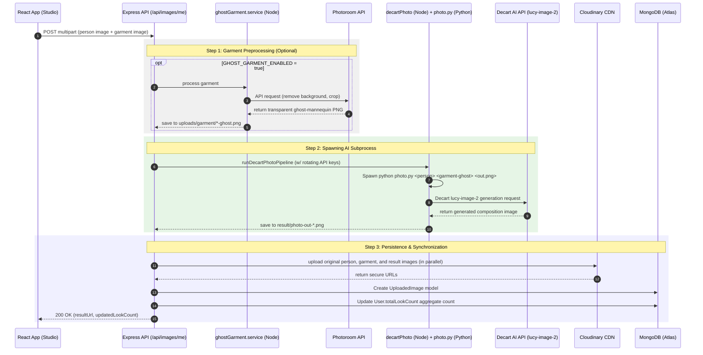
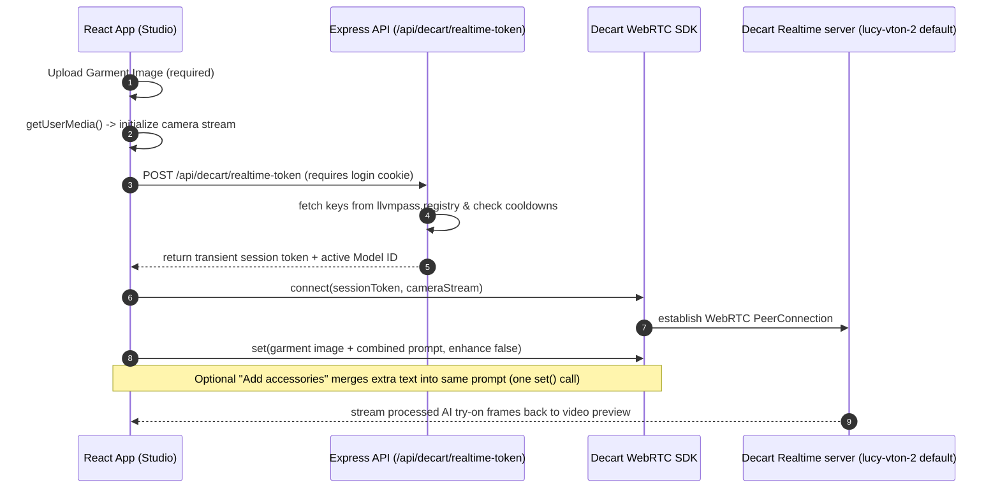

# Weartual — Full Project Architecture & Reference Guide

Welcome to the comprehensive developer guide for **Weartual**—a state-of-the-art virtual AI try-on platform that enables users to upload a person (image/video) along with a garment image, and generates a realistic composite. It also supports live, real-time camera try-on powered by WebRTC.

This document breaks down the frontend, backend, database layers, environment setups, core services, and precise control flows.

---

## 🚀 1. High-Level Technology Stack

The application is structured as a **Monorepo** consisting of three primary layers:

```
                      +-----------------------------+
                      |       React 19 + Vite       |  (Frontend - weartual/)
                      |  Tailwind / HSL CSS / PWA   |
                      +--------------+--------------+
                                     |  HTTP / WebRTC
                                     v
                      +-----------------------------+
                      |       NodeJS + Express      |  (Backend - server/)
                      |     MongoDB + Mongoose      |
                      +--------------+--------------+
                                     |  Python Subprocess
                                     v
                      +-----------------------------+
                      |    Python ML Preprocessing  |  (Pipelines - server/preprocessing/)
                      |   Decart SDK + Photoroom    |
                      +-----------------------------+
```

### Core Technologies
*   **Frontend**: React 19, Vite (Fast build tool), React Router v6, Tailwind CSS & Vanilla custom styling, Progressive Web App (PWA) support.
*   **Backend**: NodeJS, ExpressJS, MongoDB Atlas (Mongoose ODM).
*   **AI Pipelines**: Python 3, Decart SDK (`lucy-image-2` for static photo try-on, `lucy-2.1-vton` for live/video try-on), Photoroom API (Ghost mannequin garment preparation).
*   **Media Storage**: Cloudinary (CDN for images, video streaming, avatars).
*   **Video Processing**: ffmpeg (for local H.264 transcoding of video try-on outputs).

---

## 📁 2. Monorepo Repository Directory Layout

The physical structure of the repository is laid out as follows:

```
website/
├── PROJECT_SUMMARY.md          ← [This File] High-level overview
├── package.json               ← Root-level utilities
├── frontend/
│   └── mushi/                  ← Monorepo git root
│       ├── .env                ← Shared Cloudinary configuration
│       ├── PROJECT.md          ← Quick-reference layout file
│       ├── server/             ← Backend Application Directory
│       │   ├── src/
│       │   │   ├── server.js    # Entry Point: Configures environment, connects database, starts server
│       │   │   ├── app.js       # Express App: Registers middleware (CORS, Parsers), mounts api routers
│       │   │   ├── routes/      # Endpoints: auth.js, images.js, decart.js, feedback.js
│       │   │   ├── controllers/ # Request/Response controllers matching routes
│       │   │   ├── services/    # Business Logic: auth, images, decart, feedback, notifications, ghost
│       │   │   ├── models/      # MongoDB Schema definitions (User, UploadedImage, Feedback)
│       │   │   ├── middlewares/ # requireAuth, errorHandler, multer uploads
│       │   │   ├── config/      # System Configs: db.js, cloudinary.js, email.js
│       │   │   └── utils/       # Helpers: AppError, transcodeWebVideo, decartPythonVendorEnv
│       │   ├── preprocessing/  # Python Preprocessing Pipeline Scripts
│       │   │   ├── photo.py     # Image-to-image try-on using Decart
│       │   │   ├── irl.py       # Video-to-video try-on using WebRTC simulation
│       │   │   ├── ghost/       # Photoroom-based ghost mannequin cropping tool
│       │   │   └── vendor_cache/# Prompts, API key registries, local rotating loaders
│       │   ├── uploads/         # Local workspace directory for incoming client files
│       │   ├── result/          # Local workspace directory for generated AI output media
│       │   ├── python_vendor/   # Sandbox library folder containing installed pip dependencies
│       │   ├── requirements.txt # Python dependency declaration
│       │   └── .env             # Core backend configuration file
│       └── weartual/           # Frontend React Application Directory
│           ├── src/
│           │   ├── App.jsx      # Navigation, Routing, Session Bootstrap, Tour state
│           │   ├── components/  # Layout elements (Navbar, UI components, AnimatedRoutesLayout)
│           │   ├── pages/       # Screen Views (Landing, Studio, Profile, History, About, Auth)
│           │   ├── services/    # API Connectors: authApi, imageApi, decartRealtime, outfitHistory
│           │   └── config/      # api.js - exports central backend API_URL
│           ├── public/dataset/  # Static fallback assets (UI garment lists, samples)
│           ├── .env             # Local Dev frontend configurations
│           └── .env.production  # Production deployment frontend configurations
```

---

## 🎨 3. Frontend Architecture: Pages & Routes

The page routing architecture is defined inside `weartual/src/App.jsx`. It supports global layouts, navigation bars, and transitions between views.

### Application Page Mapping
| URL Path | React Component | Access Type | Function & Behavior |
|:---|:---|:---|:---|
| `/` | `LandingPage` | **Public** | Introduction to Weartual, core CTA, features list. |
| `/studio` | `TryOnStudio` | **Hybrid** | Core interface. Guest runs local mocks; logged-in user utilizes real AI APIs. |
| `/history` | `OutfitHistory` | **Hybrid** | Saved looks. Guests view local storage; users view cloud storage synchronized from MongoDB. |
| `/profile` | `Profile` | **Private** | User settings, avatar uploads, password change, and notification toggles. |
| `/about` | `AboutUs` | **Public** | Brand background and team details. |
| `/contact` | `Contact` | **Public** | Feedback submission and email contact. |
| `/login` | `Login` | **Public** | Credentials + Google OAuth input. Redirects home if already logged in. |
| `/signup` | `Signup` | **Public** | Register account. Syncs local looks to cloud automatically. |
| `/forgot-password` | `ForgetPassword`| **Public** | Password reset link solicitor. |
| `/reset-password/:token`| `ResetPassword` | **Public** | Processes secret hash token to update password. |

### Core Frontend Services (`weartual/src/services/`)
1.  **`authApi.js`**: Executes signup, standard login, Google Login (`/google`), `/me` profile retrieval, logout, and password resets. Utilizes cookie-based credential sharing.
2.  **`imageApi.js`**: Manages file uploads (image and video pairs), retrieves static dataset gallery assets, lists saved user looks, and handles deleting entries from history.
3.  **`decartRealtime.js`**: Direct camera-to-AI peer connection handler using `@decartai/sdk`. Opens WebRTC streams with Decart API using backend-minted transient session tokens.
4.  **`outfitHistory.js`**: Handles local database mocks for anonymous users. Synchronizes history records to the user account on sign-in (`tryMigrateAnonymousOutfitHistory`).

---

## 🔌 4. Backend Architecture: API Endpoints

Mounted globally under the `/api` prefix in `server/src/app.js`.

### 🔐 Auth Module: `/api/auth`
*   `POST /signup` - Creates user account, issues cryptographic session JWT.
*   `POST /login` - Validates email/password credentials, returns JWT inside HTTP-only secure cookie.
*   `POST /google` - Verifies client Google credentials and signs in.
*   `POST /logout` - Flushes client JWT cookies.
*   `POST /forgot-password` - Dispatches secret recovery hash link to email address.
*   `POST /reset-password/:token` - Accepts new password payload and marks recovery link as consumed.
*   `GET /me` - Fetches active profile payload (restores session using HTTP-only cookie).
*   `PATCH /me` - Updates fields like username and notification preferences.
*   `POST /me/avatar` - Uploads avatar portrait to Cloudinary and saves its reference inside the MongoDB User profile.

### 🖼️ Image/Try-On Module: `/api/images`
*   `GET /samples` - Lists built-in image samples for Try-On Studio (falls back to local bundles if dataset is missing).
*   `GET /samples/file` - Serves specific image samples.
*   `GET /me` - Fetches list of saved user try-on outcomes (only returns records containing a completed `resultUrl`).
*   `GET /me/look-count` - Returns the aggregated tally of successful user try-on jobs.
*   `POST /me` - **The primary processing gateway**. Processes multipart form requests containing `image` (person) and `garment` files. Automatically determines media types and executes the image or video pipeline.
*   `DELETE /me/:jobId` - Deletes a saved look, releases associated DB records, and decrements total count.
*   `POST /me/delete-by-result` - Deletes a look mapping directly to a specific Cloudinary URL.
*   `GET /jobs/:jobId/decart-result` - Standard stream response helper (reads locally cached video from disk for H.264 video playbacks).

### ⚡ Decart Live Module: `/api/decart`
*   `POST /realtime-token` - Authenticates client requests and retrieves a high-speed transient WebRTC token from Decart.

### 📧 Feedback Module: `/api/feedback`
*   `POST /` - Accepts contact feedback submissions, writes to DB, and sends acknowledgment email to the sender.

---

## 🛠️ 5. Key Orchestration Logic & Pipeline Architecture

The primary logic is handled within the service level of the NodeJS stack. 

### 1. Unified Try-On Handler: `images.service.js` -> `uploadImageService()`
When files are posted to `POST /api/images/me`, the handler performs the following steps:
1.  **Validation**: Asserts person file size (<100MB), garment file size (<10MB), and validates mime-types (Images must be JPEG/PNG/WebP, Person videos can be MP4/MOV/WebM/WebP).
2.  **Local Stash**: Writes incoming buffers into the local filesystem under `uploads/image/` and `uploads/garment/` respectively using their sanitised original names.
3.  **Route Detection**:
    *   **If Person is Video**:
        *   Initiates parallel uploads of original inputs to Cloudinary.
        *   Spawns `server/preprocessing/irl.py` subprocess.
        *   Once video file output is compiled, calls `transcodeToH264FastStartInPlace()` to ensure the video has H.264 video tracks with "faststart" metadata enabled (crucial for web-browsers to stream the video instantly before it is completely downloaded).
        *   Uploads output `.mp4` as a Cloudinary video resource.
    *   **If Person is Image**:
        *   **Ghost Mannequin Check**: If `GHOST_GARMENT_ENABLED=true`, it first spawns `server/preprocessing/ghost/ghost.py` (which sends the garment image to the Photoroom API, generating a clean transparent mannequin-cropped garment output in `uploads/garment/*-ghost.png`).
        *   Spawns `server/preprocessing/photo.py` using the person image and the cropped garment image.
        *   Once completed, reads the resulting PNG file from disk and uploads it as an image resource to Cloudinary.
4.  **Database Write**: Inserts the URLs (original person, original garment, result output) into the `UploadedImage` Mongoose model.
5.  **Aggregate Sync**: Calls `syncAccountLookCount()` to refresh the cached counter inside the `User` MongoDB model and return the final user balance to the UI.

### 2. Spawning Python: `decartPhoto.service.js`
The bridge between NodeJS and Python is managed by spawning a Child Subprocess. Key patterns include:
*   **Virtual Dependency Loading (`python_vendor`)**: Rather than relying on system-wide python environments, a utility merges the local virtual vendor folder path into python's runtime path:
    ```javascript
    // Merges custom python vendor library environment mapping
    export const mergeDecartVendorPythonPath = (env) => {
      const vendorPath = path.resolve(__dirname, "../../python_vendor");
      const existing = env.PYTHONPATH || "";
      return {
        ...env,
        PYTHONPATH: existing ? `${vendorPath}${path.delimiter}${existing}` : vendorPath
      };
    };
    ```
*   **Decart API Key Rotation & Cooldowns**:
    Decart key limits are highly volatile. To prevent single key exhaustions:
    1.  Keys are retrieved from `server/preprocessing/vendor_cache/llvmpass.registry` (which acts as a rotatable storage).
    2.  `getDecartApiKeysForTryOn()` shuffles keys and discards any keys currently registered inside `decartKeyCooldown.js` (marked as cooled-down after hitting rate-limits or quota exhausted errors).
    3.  If an attempt fails with a provider error, the Node orchestrator catches the failure, marks that key as "cooled down", and instantly retries the subprocess using the next available key in the queue, ensuring uninterrupted user experience.
*   **Python Exit Codes**: If the Python subprocess exits with code `3` or outputs `TryOnNoChange`, it indicates Decart did not detect a person/garment combination, throwing a friendly `422 Unprocessable` error to the frontend.

---

## 📊 6. End-to-End Try-On Flowcharts

### Flow A: Static Photo Try-On



---

### Flow B: Live Camera Try-On (WebRTC)

Studio **Live** mode (`TryOnStudio.jsx` + `decartRealtime.js`). The **Garment Image** upload is always the single Decart reference image.



**Garment + accessories behavior:**

| Add accessories | Reference | Prompt |
|-----------------|-----------|--------|
| Off | Garment Image only | Built-in garment VTON prompt |
| On | Same Garment Image | Garment prompt + user/env accessory text (single string) |

Do not send a follow-up `setPrompt()` without the garment image — it removes the try-on effect. `VITE_DECART_VTON_PROMPT` is the default accessory line only.

---

## 🔐 7. Environment Variables Reference

Environment configurations are separated between the server backend and the Vite client.

### Backend Configurations (`server/.env`)
| Variable | Expected Value Type | Purpose |
|:---|:---|:---|
| `PORT` | `Number` | Express listening port (default: `5001`). |
| `NODE_ENV` | `development` / `production` | Handles cookie security flags and detailed stack trace outputs. |
| `MONGODB_URI` | `String` (MongoDB Atlas URI) | Database connection URL. |
| `JWT_SECRET` | `String` | Private cryptographic signing seed for JWT. |
| `JWT_EXPIRES_IN` | `String` (e.g. `7d`) | Lifetime token expiration threshold. |
| `GOOGLE_CLIENT_ID` | `String` (Client Key) | OAuth verification client key. |
| `CLIENT_URL` | `String` (Comma-separated) | CORS Allowed origins (Crucial for cookies in production deployment). |
| `CLOUDINARY_CLOUD_NAME`| `String` | Storage container identifier. |
| `CLOUDINARY_API_KEY` | `String` | Storage authorization key. |
| `CLOUDINARY_API_SECRET`| `String` | Storage authorization private secret. |
| `PHOTOROOM_API_KEY` | `String` (sandbox/production) | Authorization for background remover. |
| `SMTP_HOST` | `String` (e.g. `smtp.gmail.com`) | Target mail dispatch server. |
| `SMTP_PORT` | `Number` (e.g. `587`) | Mail dispatch listening port. |
| `SMTP_USER` | `String` | Dispatch email sender address. |
| `SMTP_PASS` | `String` | Dispatch email security password. |
| `GHOST_GARMENT_ENABLED`| `true` / `false` | Skips Photoroom preprocessing (~8-15s faster) when set to `false`. |
| `IMAGE_TRYON_FAST` | `true` / `false` | Faster image try-on execution toggle in python subprocess. |
| `DECART_PYTHON` | `python` / `python3` / absolute path | Overrides target Python interpreter binary to use. |
| `DECART_KEY_COOLDOWN_MS`| `Number` | Time duration for which a failed API key remains in quarantine. |

> [!NOTE]
> Decart developer API keys are **not** loaded from the `.env` file. They are fetched dynamically from `preprocessing/vendor_cache/llvmpass.registry` to facilitate rapid, secure, hot-swappable key rotation.

### Frontend Configurations (`weartual/.env` / `.env.production`)
| Variable | Purpose |
|:---|:---|
| `VITE_API_URL` | Endpoint targeting backend node servers (e.g. `http://localhost:5001` or production host). |
| `VITE_GOOGLE_CLIENT_ID` | Renders Google Sign-In components. |

---

## 🗄️ 8. Database Schemas (MongoDB / Mongoose)

Weartual utilizes three core schemas in MongoDB:

```
                  +-----------------------------------+
                  |             User                  |
                  +-----------------------------------+
                  | _id: ObjectId                     |
                  | username: String                  |
                  | email: String                     |
                  | password: String (hashed)         |
                  | loginPlatform: web | google       |
                  | totalLookCount: Number (cached)   |
                  | avatarUrl: String                 |
                  +-----------------+-----------------+
                                    |
                                    | 1
                                    |
                                    | N
                  +-----------------v-----------------+
                  |         UploadedImage             |
                  +-----------------------------------+
                  | _id: ObjectId                     |
                  | userId: ObjectId (Ref: User)      |
                  | imageFilename: String             |
                  | garmentFilename: String           |
                  | imageUrl: String                  |
                  | garmentUrl: String                |
                  | resultUrl: String                 |
                  | resultType: image | video         |
                  +-----------------------------------+
```

### 1. `User` Schema
Tracks profiles, security settings, and aggregation counters:
*   `username` (String, required, trimmed)
*   `email` (String, required, unique, lowercase)
*   `loginPlatform` (String: `'web'` or `'google'`, default `'web'`)
*   `googleSub` (String, optional, unique index for OAuth)
*   `password` (String, required for web registrations, hashed via bcrypt)
*   `avatarUrl` (String, profile picture reference)
*   `totalLookCount` (Number, default `0` - cached count of successful try-ons, synced on write/delete)
*   `expoPushToken` (String, optional mobile push notification handle)
*   `notificationsEnabled` (Boolean, default `true`)

### 2. `UploadedImage` Schema (Saved Look)
Captures inputs and generation outcomes:
*   `userId` (ObjectId, referenced to `User` model, index: true)
*   `imageFilename` / `garmentFilename` (String, local base storage name)
*   `imageUrl` / `garmentUrl` (String, original assets stored on Cloudinary)
*   `resultUrl` (String, output asset stored on Cloudinary - lookup criteria for valid look)
*   `resultFilename` (String, on-disk target storage output identifier)
*   `resultType` (String: `'image'` or `'video'`, default `'image'`)
*   `stableVitonBundle` (Object, stores detailed input properties for advanced dataset syncs)

### 3. `Feedback` Schema
Collects contact responses:
*   `name` (String, required)
*   `email` (String, required)
*   `feedback` (String, required message body)

---

## 🏃 9. Quick Start Development Workflow

To initialize the monorepo workspace for development:

### 1. Configure the Environments
Ensure local environment files are structured:
*   Copy backend `.env` variables into `frontend/mushi/server/.env`.
*   Ensure the target backend is listening on `PORT=5001`.
*   Add Decart API keys to `frontend/mushi/server/preprocessing/vendor_cache/llvmpass.registry` (one key per line).
*   Add client variables in `frontend/mushi/weartual/.env`, verifying `VITE_API_URL=http://localhost:5001`.

### 2. Install Dependencies
Run npm installations in their respective project directories:
```bash
# Install Server modules (triggers server postinstall: downloads python decart libraries)
cd frontend/mushi/server
npm install

# Install Frontend modules
cd frontend/mushi/weartual
npm install
```

### 3. Boot Local Servers
Launch Node backend and Vite client:
```bash
# Launch backend node environment (via nodemon)
cd frontend/mushi/server
npm run dev

# Launch frontend vite web client
cd frontend/mushi/weartual
npm run dev
```

---

*Last Updated: May 20, 2026. This architecture diagram is maintained dynamically. Ensure secrets remain localized to gitignored `.env` and `.registry` files.*
