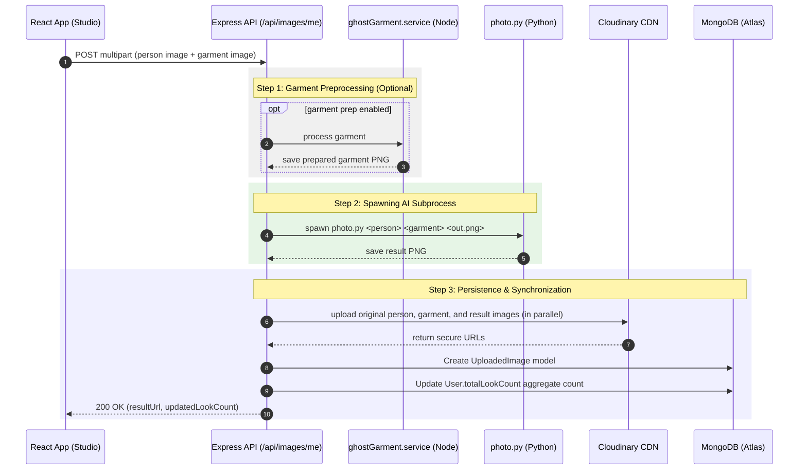
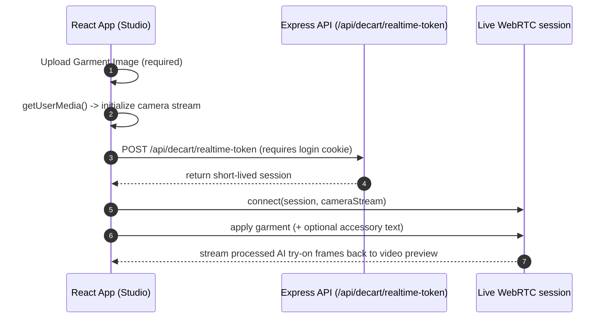

# Weartual — Full Project Architecture & Reference Guide

Welcome to the comprehensive developer guide for **Weartual**—a virtual try-on platform that enables users to upload a person (image/video) along with a garment image, and generates a realistic composite. It also supports live, real-time camera try-on powered by WebRTC.

This document breaks down the frontend, backend, database layers, environment setups, core services, and control flows.

---

## 1. High-Level Technology Stack

The application is structured as a **Monorepo** consisting of three primary layers:

```
                      +-----------------------------+
                      |       React 19 + Vite       |  (Frontend - weartual/)
                      |  Tailwind / HSL CSS / PWA   |
                      +--------------+--------------+
                                     |  HTTP / WebRTC
                                     v
                      +-----------------------------+
                      |       NodeJS + Express      |  (Backend - server/)
                      |     MongoDB + Mongoose      |
                      +--------------+--------------+
                                     |  Python Subprocess
                                     v
                      +-----------------------------+
                      |    Python ML Preprocessing  |  (Pipelines - server/preprocessing/)
                      |   Image / video / garment   |
                      +-----------------------------+
```

### Core Technologies
*   **Frontend**: React 19, Vite, React Router, Tailwind CSS & custom styling, Progressive Web App (PWA) support.
*   **Backend**: NodeJS, ExpressJS, MongoDB Atlas (Mongoose ODM).
*   **AI Pipelines**: Python 3 scripts for static photo try-on, video try-on, and optional garment preparation.
*   **Media Storage**: Cloudinary (CDN for images, video streaming, avatars).
*   **Video Processing**: ffmpeg (for local H.264 transcoding of video try-on outputs).

---

## 2. Monorepo Repository Directory Layout

The physical structure of the repository is laid out as follows:

```
website/
├── PROJECT_SUMMARY.md          ← [This File] High-level overview
├── package.json               ← Root-level utilities
├── frontend/
│   └── mushi/                  ← Monorepo git root
│       ├── PROJECT.md          ← Quick-reference layout file
│       ├── server/             ← Backend Application Directory
│       │   ├── src/
│       │   │   ├── server.js    # Entry Point: Configures environment, connects database, starts server
│       │   │   ├── app.js       # Express App: Registers middleware (CORS, Parsers), mounts api routers
│       │   │   ├── routes/      # Endpoints: auth, images, live try-on, feedback
│       │   │   ├── controllers/ # Request/Response controllers matching routes
│       │   │   ├── services/    # Business Logic: auth, images, try-on, feedback, notifications, ghost
│       │   │   ├── models/      # MongoDB Schema definitions (User, UploadedImage, Feedback)
│       │   │   ├── middlewares/ # requireAuth, errorHandler, multer uploads
│       │   │   ├── config/      # System Configs: db.js, cloudinary.js, email.js
│       │   │   └── utils/       # Helpers: AppError, transcodeWebVideo, Python vendor path helpers
│       │   ├── preprocessing/  # Python Preprocessing Pipeline Scripts
│       │   │   ├── photo.py     # Image-to-image try-on
│       │   │   ├── irl.py       # Video try-on
│       │   │   ├── ghost/       # Optional garment preparation
│       │   │   └── vendor_cache/# Local pipeline support files
│       │   ├── uploads/         # Local workspace directory for incoming client files
│       │   ├── result/          # Local workspace directory for generated AI output media
│       │   ├── python_vendor/   # Sandbox library folder containing installed pip dependencies
│       │   ├── requirements.txt # Python dependency declaration
│       │   └── .env             # Core backend configuration file (gitignored)
│       └── weartual/           # Frontend React Application Directory
│           ├── src/
│           │   ├── App.jsx      # Navigation, Routing, Session Bootstrap, Tour state
│           │   ├── components/  # Layout elements (Navbar, UI components, AnimatedRoutesLayout)
│           │   ├── pages/       # Screen Views (Landing, Studio, Profile, History, About, Auth)
│           │   ├── services/    # API Connectors: authApi, imageApi, live realtime, outfitHistory
│           │   └── config/      # api.js - exports central backend API_URL
│           ├── public/dataset/  # Static fallback assets (UI garment lists, samples)
│           ├── .env             # Local Dev frontend configurations (gitignored)
│           └── .env.production  # Production deployment frontend configurations (gitignored)
```

---

## 3. Frontend Architecture: Pages & Routes

The page routing architecture is defined inside `weartual/src/App.jsx`. It supports global layouts, navigation bars, and transitions between views.

### Application Page Mapping
| URL Path | React Component | Access Type | Function & Behavior |
|:---|:---|:---|:---|
| `/` | `LandingPage` | **Public** | Introduction to Weartual, core CTA, features list. |
| `/studio` | `TryOnStudio` | **Hybrid** | Core interface. Guest runs local mocks; logged-in user utilizes real AI APIs. |
| `/history` | `OutfitHistory` | **Hybrid** | Saved looks. Guests view local storage; users view cloud storage synchronized from MongoDB. |
| `/profile` | `Profile` | **Private** | User settings, avatar uploads, password change, and notification toggles. |
| `/about` | `AboutUs` | **Public** | Brand background and team details. |
| `/contact` | `Contact` | **Public** | Feedback submission and email contact. |
| `/login` | `Login` | **Public** | Credentials + Google OAuth input. Redirects home if already logged in. |
| `/signup` | `Signup` | **Public** | Register account. Syncs local looks to cloud automatically. |
| `/forgot-password` | `ForgetPassword`| **Public** | Password reset link solicitor. |
| `/reset-password/:token`| `ResetPassword` | **Public** | Processes reset token to update password. |

### Core Frontend Services (`weartual/src/services/`)
1.  **`authApi.js`**: Executes signup, standard login, Google Login (`/google`), `/me` profile retrieval, logout, and password resets. Utilizes cookie-based credential sharing.
2.  **`imageApi.js`**: Manages file uploads (image and video pairs), retrieves static dataset gallery assets, lists saved user looks, and handles deleting entries from history.
3.  **`decartRealtime.js`**: Live camera WebRTC client. Opens a peer connection using a short-lived session issued by the backend.
4.  **`outfitHistory.js`**: Handles local database mocks for anonymous users. Synchronizes history records to the user account on sign-in (`tryMigrateAnonymousOutfitHistory`).

---

## 4. Backend Architecture: API Endpoints

Mounted globally under the `/api` prefix in `server/src/app.js`.

### Auth Module: `/api/auth`
*   `POST /signup` - Creates user account, issues cryptographic session JWT.
*   `POST /login` - Validates email/password credentials, returns JWT inside HTTP-only secure cookie.
*   `POST /google` - Verifies client Google credentials and signs in.
*   `POST /logout` - Flushes client JWT cookies.
*   `POST /forgot-password` - Dispatches recovery link to email address.
*   `POST /reset-password/:token` - Accepts new password payload and marks recovery link as consumed.
*   `GET /me` - Fetches active profile payload (restores session using HTTP-only cookie).
*   `PATCH /me` - Updates fields like username and notification preferences.
*   `POST /me/avatar` - Uploads avatar portrait to Cloudinary and saves its reference inside the MongoDB User profile.

### Image/Try-On Module: `/api/images`
*   `GET /samples` - Lists built-in image samples for Try-On Studio (falls back to local bundles if dataset is missing).
*   `GET /samples/file` - Serves specific image samples.
*   `GET /me` - Fetches list of saved user try-on outcomes (only returns records containing a completed `resultUrl`).
*   `GET /me/look-count` - Returns the aggregated tally of successful user try-on jobs.
*   `POST /me` - **The primary processing gateway**. Processes multipart form requests containing `image` (person) and `garment` files. Automatically determines media types and executes the image or video pipeline.
*   `DELETE /me/:jobId` - Deletes a saved look, releases associated DB records, and decrements total count.
*   `POST /me/delete-by-result` - Deletes a look mapping directly to a specific Cloudinary URL.
*   `GET /jobs/:jobId/decart-result` - Streams locally cached video from disk for H.264 playback.

### Live Try-On Module: `/api/decart`
*   `POST /realtime-token` - Authenticates the client and returns a short-lived WebRTC session for Live mode.

### Feedback Module: `/api/feedback`
*   `POST /` - Accepts contact feedback submissions, writes to DB, and sends acknowledgment email to the sender.

---

## 5. Key Orchestration Logic & Pipeline Architecture

The primary logic is handled within the service level of the NodeJS stack.

### 1. Unified Try-On Handler: `images.service.js` -> `uploadImageService()`
When files are posted to `POST /api/images/me`, the handler performs the following steps:
1.  **Validation**: Asserts person file size (<100MB), garment file size (<10MB), and validates mime-types (Images must be JPEG/PNG/WebP, Person videos can be MP4/MOV/WebM/WebP).
2.  **Local Stash**: Writes incoming buffers into the local filesystem under `uploads/image/` and `uploads/garment/` respectively using their sanitised original names.
3.  **Route Detection**:
    *   **If Person is Video**:
        *   Initiates parallel uploads of original inputs to Cloudinary.
        *   Spawns `server/preprocessing/irl.py` subprocess.
        *   Once video file output is compiled, calls `transcodeToH264FastStartInPlace()` to ensure the video has H.264 video tracks with "faststart" metadata enabled (crucial for web-browsers to stream the video instantly before it is completely downloaded).
        *   Uploads output `.mp4` as a Cloudinary video resource.
    *   **If Person is Image**:
        *   **Garment prep (optional)**: If enabled in server config, spawns `server/preprocessing/ghost/ghost.py` to prepare a cleaned garment asset.
        *   Spawns `server/preprocessing/photo.py` using the person image and the prepared garment image.
        *   Once completed, reads the resulting PNG file from disk and uploads it as an image resource to Cloudinary.
4.  **Database Write**: Inserts the URLs (original person, original garment, result output) into the `UploadedImage` Mongoose model.
5.  **Aggregate Sync**: Calls `syncAccountLookCount()` to refresh the cached counter inside the `User` MongoDB model and return the final user balance to the UI.

### 2. Spawning Python
The bridge between NodeJS and Python is managed by spawning a child subprocess. Key patterns include:
*   **Virtual Dependency Loading (`python_vendor`)**: Rather than relying on system-wide Python environments, a utility merges the local vendor folder into Python’s runtime path (`PYTHONPATH`).
*   **Retries / failover**: The orchestrator can retry failed pipeline runs with alternate credentials when configured.
*   **Python Exit Codes**: If the Python subprocess exits with code `3` or outputs `TryOnNoChange`, the server returns a friendly `422 Unprocessable` error to the frontend.

---

## 6. End-to-End Try-On Flowcharts

### Flow A: Static Photo Try-On


```mermaid
sequenceDiagram
  autonumber
  participant Client as React App (Studio)
  participant API as Express API (/api/images/me)
  participant Ghost as ghostGarment.service (Node)
  participant PhotoPy as photo.py (Python)
  participant Cloudinary as Cloudinary CDN
  participant DB as MongoDB (Atlas)

  Client->>API: POST multipart (person image + garment image)

  rect rgb(240, 240, 240)
    Note over API,Ghost: Step 1: Garment Preprocessing (Optional)
    opt garment prep enabled
      API->>Ghost: process garment
      Ghost-->>API: save prepared garment PNG
    end
  end

  rect rgb(230, 245, 230)
    Note over API,PhotoPy: Step 2: Spawning AI Subprocess
    API->>PhotoPy: spawn photo.py <person> <garment> <out.png>
    PhotoPy-->>API: save result PNG
  end

  rect rgb(240, 240, 255)
    Note over API,DB: Step 3: Persistence & Synchronization
    API->>Cloudinary: upload original person, garment, and result images (in parallel)
    Cloudinary-->>API: return secure URLs
    API->>DB: Create UploadedImage model
    API->>DB: Update User.totalLookCount aggregate count
    API-->>Client: 200 OK (resultUrl, updatedLookCount)
  end
```

---

### Flow B: Live Camera Try-On (WebRTC)

Studio **Live** mode (`TryOnStudio.jsx` + live realtime client). The **Garment Image** upload is the single reference image.


```mermaid
sequenceDiagram
  autonumber
  participant Client as React App (Studio)
  participant API as Express API (/api/decart/realtime-token)
  participant Live as Live WebRTC session

  Client->>Client: Upload Garment Image (required)
  Client->>Client: getUserMedia() -> initialize camera stream
  Client->>API: POST /api/decart/realtime-token (requires login cookie)
  API-->>Client: return short-lived session
  Client->>Live: connect(session, cameraStream)
  Client->>Live: apply garment (+ optional accessory text)
  Live-->>Client: stream processed AI try-on frames back to video preview
```

**Garment + accessories behavior:**

| Add accessories | Reference | Behavior |
|-----------------|-----------|----------|
| Off | Garment Image only | Garment try-on |
| On | Same Garment Image | Garment try-on plus user accessory text |

---

## 7. Environment Variables Reference

Environment configurations are separated between the server backend and the Vite client. **Never commit secret files.**

### Backend (`server/.env`)
Configure runtime, database, auth, CORS, media storage, email, and try-on feature flags as required for your deployment. Ask the team for the private checklist.

### Frontend (`weartual/.env` / `.env.production`)
| Variable | Purpose |
|:---|:---|
| `VITE_API_URL` | Endpoint targeting backend node servers (e.g. `http://localhost:5001` or production host). |
| `VITE_GOOGLE_CLIENT_ID` | Renders Google Sign-In components. |

---

## 8. Database Schemas (MongoDB / Mongoose)

Weartual utilizes three core schemas in MongoDB:

```
                  +-----------------------------------+
                  |             User                  |
                  +-----------------------------------+
                  | _id: ObjectId                     |
                  | username: String                  |
                  | email: String                     |
                  | password: String (hashed)         |
                  | loginPlatform: web | google       |
                  | totalLookCount: Number (cached)   |
                  | avatarUrl: String                 |
                  +-----------------+-----------------+
                                    |
                                    | 1
                                    |
                                    | N
                  +-----------------v-----------------+
                  |         UploadedImage             |
                  +-----------------------------------+
                  | _id: ObjectId                     |
                  | userId: ObjectId (Ref: User)      |
                  | imageFilename: String             |
                  | garmentFilename: String           |
                  | imageUrl: String                  |
                  | garmentUrl: String                |
                  | resultUrl: String                 |
                  | resultType: image | video         |
                  +-----------------------------------+
```

### 1. `User` Schema
Tracks profiles, security settings, and aggregation counters:
*   `username` (String, required, trimmed)
*   `email` (String, required, unique, lowercase)
*   `loginPlatform` (String: `'web'` or `'google'`, default `'web'`)
*   `googleSub` (String, optional, unique index for OAuth)
*   `password` (String, required for web registrations, hashed via bcrypt)
*   `avatarUrl` (String, profile picture reference)
*   `totalLookCount` (Number, default `0` - cached count of successful try-ons, synced on write/delete)
*   `expoPushToken` (String, optional mobile push notification handle)
*   `notificationsEnabled` (Boolean, default `true`)

### 2. `UploadedImage` Schema (Saved Look)
Captures inputs and generation outcomes:
*   `userId` (ObjectId, referenced to `User` model, index: true)
*   `imageFilename` / `garmentFilename` (String, local base storage name)
*   `imageUrl` / `garmentUrl` (String, original assets stored on Cloudinary)
*   `resultUrl` (String, output asset stored on Cloudinary - lookup criteria for valid look)
*   `resultFilename` (String, on-disk target storage output identifier)
*   `resultType` (String: `'image'` or `'video'`, default `'image'`)
*   `stableVitonBundle` (Object, stores detailed input properties for advanced dataset syncs)

### 3. `Feedback` Schema
Collects contact responses:
*   `name` (String, required)
*   `email` (String, required)
*   `feedback` (String, required message body)

---

## 9. Quick Start Development Workflow

To initialize the monorepo workspace for development:

### 1. Configure the Environments
*   Create `server/.env` with the private values for your environment.
*   Ensure the target backend is listening on `PORT=5001`.
*   Add client variables in `weartual/.env`, verifying `VITE_API_URL=http://localhost:5001`.

### 2. Install Dependencies
```bash
# Install Server modules (triggers postinstall for Python vendor packages)
cd frontend/mushi/server
npm install

# Install Frontend modules
cd frontend/mushi/weartual
npm install
```

### 3. Boot Local Servers
```bash
# Launch backend
cd frontend/mushi/server
npm run dev

# Launch frontend
cd frontend/mushi/weartual
npm run dev
```

---

*Last Updated: Aug 14, 2026. Keep secrets in gitignored env files only — do not document provider keys, prompts, or registry paths in the repo.*
